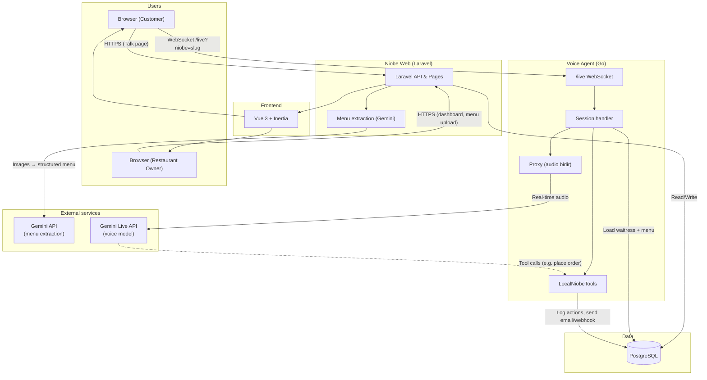

# Niobe Architecture

This document describes how the Niobe system is structured and how **Gemini** connects to the backend, database, and frontend.

## High-level overview

Niobe has three main parts:

| Component | Role |
|-----------|------|
| **Niobe (web)** | Laravel + Vue 3 + Inertia app: dashboard, waitress management, menu upload, and **Gemini-powered menu extraction** from images. |
| **Agent** | Go service: **live voice** via **Gemini Live API**, menu-aware ordering, tool execution (orders, email, webhooks). Shares the same PostgreSQL database as Laravel. |
| **PostgreSQL** | Single database used by both Laravel and the Agent (waitresses, menu items, action logs, users, etc.). |

---

## Architecture diagram

---

## How Gemini connects

### 1. Gemini in the Laravel app (Niobe web)

- **Purpose:** Extract structured menu and context from **uploaded menu images**.
- **Flow:** Restaurant owner uploads images in the dashboard → Laravel sends them to **Gemini API** (via Laravel AI / Gemini driver) → Gemini returns structured text/JSON → Laravel stores extracted context and menu items in **PostgreSQL**.
- **Config:** `niobe/config/ai.php` (default provider `gemini`), `GEMINI_API_KEY` in `.env`.
- **Code:** `niobe/app/Services/ContextExtractionService.php`, `MenuExtractionService.php`.

### 2. Gemini in the Voice Agent (Go)

- **Purpose:** **Live voice conversation** with the AI waitress (speech in, speech out) and **tool use** (e.g. place order, send email).
- **Flow:**
  1. Customer opens the **Talk** page and connects via **WebSocket** to the Agent: `ws://<agent>/live?niobe=<slug>`.
  2. Agent looks up the waitress and menu by `slug` from **PostgreSQL**, builds system instruction + tools, and opens a **Gemini Live** session (Google GenAI SDK).
  3. **Proxy** bridges: browser ↔ Agent ↔ **Gemini Live API** (bidirectional audio).
  4. When the model decides to run an action (e.g. place order), it sends a **tool call** to the Agent. The Agent runs **LocalNiobeTools** (writes to DB, sends email/webhook) and returns the result to Gemini, which then speaks the outcome to the user.
- **Config:** Agent uses `GEMINI_API_KEY` (or `GOOGLE_API_KEY`), optional `GOOGLE_GENAI_USE_VERTEXAI` for Vertex.
- **Code:** `agent/live/google.go` (Gemini Live connection), `agent/handler/handler.go` (session + tools), `agent/proxy/proxy.go` (WebSocket ↔ Gemini), `agent/tools/local.go` (tool execution and DB).

---

## Data flow summary

| Path | Description |
|------|-------------|
| **Dashboard → Laravel → PostgreSQL** | Create/update waitresses, upload menu images, store extracted menu. |
| **Laravel → Gemini API** | Menu extraction (images → structured menu/context). |
| **Talk page → Agent (WebSocket)** | Customer starts voice session; Agent gets waitress config from PostgreSQL. |
| **Agent → Gemini Live API** | Real-time audio and tool calls for the voice conversation. |
| **Agent (LocalNiobeTools) → PostgreSQL** | Log actions (`waitress_action_logs`), read waitresses/menu items. |
| **Agent → SMTP / Webhooks** | Send order emails or webhook events when tools are executed. |

---

## Deployment (reference)

- **Deploy:** GCP (Terraform, Cloud Build). See `deploy/README.md` and `deploy/DEPLOY-GCP.md`.
- In production, Laravel and the Agent typically connect to the same **Cloud SQL (PostgreSQL)** instance; the Agent is often run on **Cloud Run** and the web app on **App Engine** or similar.
